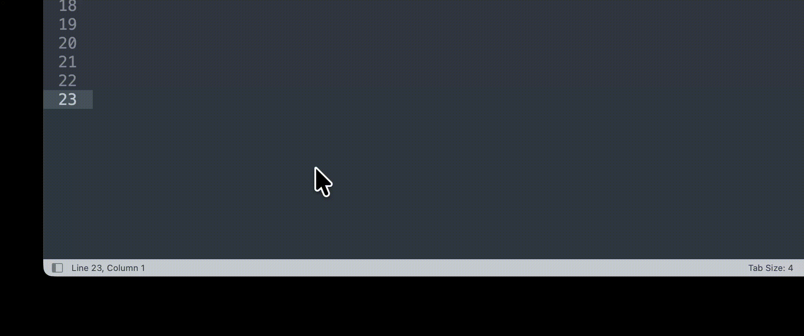

# VoiceInput (doubao_mic)

我们做这个功能主要是因为豆包大模型的语音识别非常方便，但 Mac 版语音输入法迟迟没有推出，所以只好自己做了一个。

macOS 菜单栏语音输入工具，通过热键开始/停止录音，将识别结果插入当前输入位置。我们有两种功能：

1. **基础语音识别（含二次修正）**：当你说出语气词之类的内容时，系统会帮你修正。
2. **语音整理**：我们特有的功能，语音输入后自动整理。

你可以先看一下演示界面：



---

## 项目结构

- `doubao_mic/`: Xcode 工程与源码目录

## Config

应用从 `~/.voiceinput/ak.yaml` 读取凭证。

从模板复制并填写：

```bash
mkdir -p ~/.voiceinput
cp ak.example.yaml ~/.voiceinput/ak.yaml
```

键说明：

| Key | 必填 | 用途 |
| --- | --- | --- |
| `appId` | 是 | ASR WebSocket 鉴权 |
| `accessToken` | 是 | ASR WebSocket 鉴权 |
| `seedApiKey` | 否 | 仅“语音整理”热键调用 Seed 接口时需要 |

配置示例：

```yaml
appId: your_app_id
accessToken: your_access_token
seedApiKey: your_seed_api_key
```

## Build

先初始化本地签名覆盖文件：

```bash
cd doubao_mic
cp Signing.local.example.xcconfig Signing.local.xcconfig
```

- 将 `Signing.local.xcconfig` 里的 `DEVELOPMENT_TEAM` 改成你自己的 Team ID。
- 或使用 xcode 打开工程，在 Build Settings，使用它的自动配置功能。

在工程目录执行：

```bash
cd doubao_mic
xcodebuild -project VoiceInput.xcodeproj -scheme VoiceInput -configuration Debug -destination 'platform=macOS,arch=arm64' DEVELOPMENT_TEAM=YOUR_TEAM_ID build
```

运行测试：

```bash
cd doubao_mic
xcodebuild test -project VoiceInput.xcodeproj -scheme VoiceInput -destination 'platform=macOS' DEVELOPMENT_TEAM=YOUR_TEAM_ID
```

## Run

推荐使用固定部署路径启动（避免权限记录混乱）：

```bash
cd doubao_mic
./scripts/dev-run.sh
```

可选：指定开发团队并启用开发签名：

```bash
cd doubao_mic
DEVELOPMENT_TEAM=YOUR_TEAM_ID ./scripts/dev-run.sh
```

脚本会自动完成：

- 构建 `VoiceInput`（Debug）
- 部署到 `/Applications/VoiceInput.app`
- 启动应用并输出 PID
- 打印签名信息（是否 ad-hoc/是否有 Team）
- 打印 `com.voiceinput.app` 的 TCC 记录和最近权限相关日志

## 权限要求（必须）

首次运行请在 macOS 系统设置中为 `VoiceInput` 授权：

- `隐私与安全性 -> 麦克风`
- `隐私与安全性 -> 辅助功能`
- `隐私与安全性 -> 输入监控`

说明：

- 回填策略为 `AX -> KeyEvents`（不使用 Paste）。
- 当目标输入控件对 AX 写入不生效时，会自动回退 `KeyEvents`。
- `KeyEvents` 依赖“输入监控”权限，未授权会导致“识别成功但无法回填”。

快速自检（开发阶段）：

```bash
cd doubao_mic
./scripts/dev-run.sh
```

## 日志体系（统一日志）

项目已统一使用 `os.Logger`（Apple Unified Logging）：

- `subsystem`: `com.voiceinput.app`
- `category`:
  - `App`
  - `Audio`
  - `ASR`
  - `Hotkey`
  - `Input`
  - `UI`
  - `Crash`

统一入口在：

- `doubao_mic/Sources/App/AppLogger.swift`

实时查看日志：

```bash
log stream --predicate 'subsystem == "com.voiceinput.app"' --style compact
```

## 严重错误与崩溃日志

### 运行时严重错误

- 业务错误（尤其 ASR 相关）会记录到 unified logging 的 `error` / `fault` 级别。
- 关键入口：
  - `doubao_mic/Sources/App/AppDelegate.swift`
  - `doubao_mic/Sources/Audio/ASRErrorHandler.swift`
  - `doubao_mic/Sources/Audio/ASRClient.swift`

### 崩溃记录

项目内置 `CrashReporter`，在应用启动时安装：

- 捕获未处理 `NSException`
- 捕获常见 fatal signals：`SIGABRT/SIGILL/SIGSEGV/SIGFPE/SIGBUS/SIGTRAP`
- 附加写入本地崩溃日志文件：
  - `~/Library/Logs/VoiceInput/crash.log`

查看崩溃日志：

```bash
cat ~/Library/Logs/VoiceInput/crash.log
```

> 说明：应用在记录自定义崩溃日志后，会重新抛出信号，保留 macOS 系统原生 crash report 行为。

## 安全建议

- 不要提交真实凭证到仓库。
- 若凭证泄露，立即轮换。
- 安全问题请通过 GitHub Issue 提报，并尽量附带复现步骤与影响范围。
